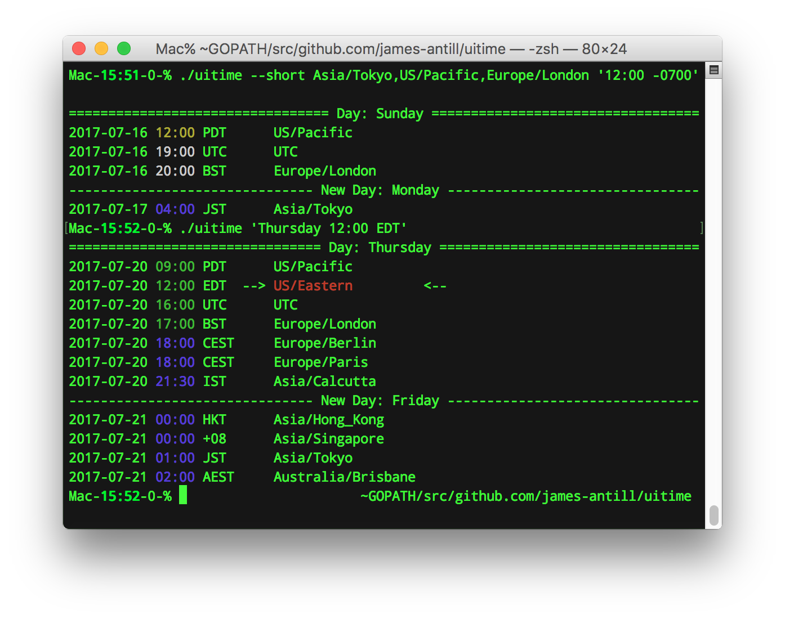

 UItime
 ======

 A simple way to see the time in a few locations around the world.

 Accepts a bunch of date/time formats as input, outputs with color to show
workday/weekends.

 Inspired by the rktime shell script, but due to real time APIs in go it's
much faster and more usable.

## Example usage:

